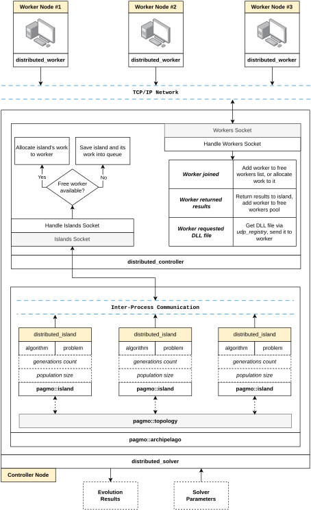

# Distributed (Meta)solver Utilizing the Pagmo Optimization Library

- Readme last updated on: 07/07/2026

## About

This repository contains source code of the **"Distributed Metasolver"** project which was developed as part of a [diploma thesis](https://github.com/jonas-s-s-s/Pagmo-solver-distributed/blob/main/Published_Thesis_Final.pdf) in 2026. The findings of this project were subsequently also published as a [conference paper](https://github.com/jonas-s-s-s/Pagmo-solver-distributed/blob/main/Short_Conference_Paper.pdf).

This software is a C++ library, intended to be embedded inside of an existing application.

## Introduction

The key contribution of this project is extending the capabilities of the Pagmo library by adding a distributed Controller-Worker model, which internally utilizes the existing "Island-Archipelago" concept. A new UDI called `distributed_island` was added, this UDI is used inside of `pagmo::archipelago`, allowing the island to communicate with an instance of `distributed_controller`. The `distributed_controller` acts as a server to which `distributed_worker` instances connect, the controller node (running the `distributed_controller` server) allocates work to connected workers and then aggregates the evolved population that is sent back by each worker. Pagmo UDPs (User Defined Problems) are distributed to workers as a shared library (e.g. `dll` file on Windows), the worker can thus dynamically load new problems on-the-go without having to be recompiled or manually modified in any way. The controller collects and saves performance statistics of each worker, this data is then used to perform load-balancing by adjusting the population size of the individual islands.

A "wrapper" class `distributed_solver` serves as an easy to use interface for the "controller side" of the library, encapsulating both the `distributed_controller` and `pagmo::archipelago`, member functions of this class can then be used to start the distributed evolution, wait for the evolution to finish, wait until the required number of workers connects, etc.

Networking is handled using the **ZeroMQ** library, messages are serialized using **Boost Serialization** (primarily because this is the serialization method already used by Pagmo). Various classes and helper functions were created to simplify the usage of these two dependencies.

The primary scientific objective of this project was to study the possibility of using multiple different optimization algorithms on each worker node in the distributed system, hence why `distributed_solver` accepts a vector of `pagmo::algorithm` in its constructor. As was described in the thesis, this approach can sometimes be beneficial, it however heavily depends on the problem and configuration of the solver. Further modifications and improvements would have to be implemented to increase the efficiency of the metasolving capabilities.

Using this library as a distributed solver with the same optimization algorithm on all worker nodes works as intented and can bring significant improvement in both computational time and the quality of solutions. One of the testing scenarios utilizing three heterogenous nodes achieved a **115%** faster execution time and **24%** better solution fitness when compared to running the exact same evolution locally on a single node. For further details see the [thesis PDF](https://github.com/jonas-s-s-s/Pagmo-solver-distributed/blob/main/Published_Thesis_Final.pdf).

<p align="center">
  
  <br>
  <em>Architecture of the metasolver distributed system, showcasing three connected workers.</em>
</p>

## Example Usage

The two examples below showcase the simplest possible scenario. A `distributed_solver` is what runs on the controller node, `distributed_worker` is a network client running on the worker nodes.

### Controller

```cpp
#include "distributed_solver.h"
#include "udp_dll_wrapper.h"
#include <pagmo/problem.hpp>
#include <pagmo/algorithms/de.hpp>

int main()
{
    // Optional: set directory containing our UDP DLLs
    udp_registry::get().set_local_cache_dir("controller_cache");

    // Construct your OWN problem here (using schwefel as an example)
    unsigned dim = 2;
    udp_dll_wrapper udp{"schwefel_udp", dim};
    pagmo::problem problem{udp};

    // Construct an algorithm (or multiple algorithms)
    pagmo::algorithm algo{pagmo::de(1000)};

    // Construct a distributed solver (controller starts internally)
    distributed_solver solver{
        "tcp://0.0.0.0:5000", // Controller address
        8, // Expected number of workers
    };

    // Wait for workers to connect
    solver.wait_until_workers_connect();

    // Run distributed evolution with a population size of 1000
    solver.evolve(problem, {algo}, 1000);

    // Wait for completion and retrieve the best individual
    pagmo::vector_double best = solver.wait_until_completion();

    return 0;
}
```

### Worker

Workers connect to the controller, download required UDP libraries on demand, and perform assigned work.

```cpp
#include "distributed_worker.h"
#include "udp_registry.h"

int main()
{
    // Connect to the controller
    distributed_worker worker{
        "tcp://localhost:5000"
    };

    // Optional: directory for cached UDP DLLs
    udp_registry::get().set_local_cache_dir("worker_cache");

    // Allows worker to download missing UDP DLLs (or so / dylib) from the controller
    udp_registry::get().register_udp_provider(
        [&worker](const std::string& libName)
        {
            return worker.get_dll_from_controller(libName);
        }
    );

    // Main worker loop
    for (;;)
    {
        worker.client_loop();
    }

    return 0;
}
```

Alternatively, you can start workers using the example application in `src/run_example/main.cpp`.

## Project Structure

| Directory | Description |
|---|---|
| `src/` | Root of the library's source tree. Contains the `distributed` module (the core library) and `run_example`, a runnable demo application. |
| `src/distributed/logic/` | The library's most important classes: `distributed_solver`, `distributed_controller`, `distributed_worker`, `distributed_island`, and related settings/repository classes. Handles work distribution, work allocation, load balancing, and running the evolutionary algorithm. |
| `src/distributed/messages/` | Defines the message payloads and the `MsgType` enum used for communication between controller and worker nodes. |
| `src/distributed/sockets/` | Wrapper classes around standard ZeroMQ sockets. Ensures multi-frame protocol messages are always sent/received correctly and adds custom serialization, since ZeroMQ doesn't provide any by default. |
| `src/distributed/dynamic/` | OS-independent logic (`lib_loader`) for loading User-Defined Problems (UDPs) from dynamic libraries (DLL/.so/.dylib) at runtime, instead of requiring them to be statically linked into every worker. |
| `src/distributed/discovery/` | Implements `udp_registry`, a thread-safe singleton acting as a service-discovery layer that centrally tracks and constructs UDP instances, avoiding duplicate loads and filesystem conflicts. |
| `src/distributed/utils/` | Miscellaneous helper files that don't belong to a specific module: logging setup (`logger_init`, `logger_control`), hashing, path normalization, and stream buffer utilities. |
| `src/distributed/benchmark/` | Classes used for debugging/testing solver performance, including running single-objective and multi-objective benchmarks against standardized problems. |
| `src/run_example/` | Contains `main.cpp`, a configurable entry point that can start a controller/worker or run a benchmark suite from the command line. |
| `test/` | Unit tests, mirroring the structure of `src/distributed/`, grouped by which part of the library they test (e.g. `sockets`, `utils`, discovery caches, logic repositories). |
